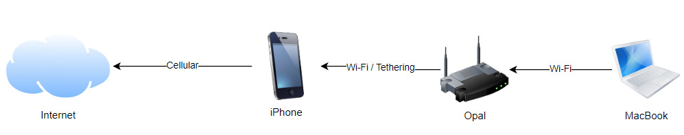

# Wie man schnell Support erhält

Zuerst einmal möchte ich Dich im Forum Willkommen heißen! :wave:

Mit dem Besuch hier hast Du den ersten Schritt getan, um schnell Support von der Community und [offiziellen GL.iNet Mitarbeitern](https://forum.gl-inet.com/about) zu erhalten. Damit das für Dich eine gute Erfahrung wird, solltest Du einige Dinge - abseits der Netiquette - beachten.

**Wichtiger Hinweis:**

Der Support hier findet in der Regel von Communitymitgliedern statt. Das sind Benutzer wie Du und ich. Sei freundlich und verstehe bitte, dass solche Personen nicht für GL.iNet arbeiten oder an der Produktentwicklung beteiligt sind. Im Zweifelsfall kannst Du Dich per E-Mail an support@gl-inet.com für offiziellen Support wenden.

## Inhaltsverzeichnis

[toc]

## Wichtige Links

### Offizielle Dokumentation

[für Firmware 4.x :link:](https://docs.gl-inet.com/router/en/4/) | [für Firmware 3.x :link:](https://docs.gl-inet.com/router/en/3/) | [für Firmware 2.x :link:](https://docs.gl-inet.com/router/en/2/)

### Anleitungen & Tutorials

[für Firmware 4.x :link:](https://docs.gl-inet.com/router/en/4/tutorials/) | [für Firmware 3.x :link:](https://docs.gl-inet.com/router/en/3/tutorials/) 

### Häufige Probleme & deren Lösungen

[für Firmware 4.x :link:](https://docs.gl-inet.com/router/en/4/faq/) | [für Firmware 3.x :link:](https://docs.gl-inet.com/router/en/3/) 

---

**Deine Firmware im Admin-Panel rausfinden:**

Nachdem Login im Admin-Panel wird die Firmwareversion oben angezeigt:


**Deine Firmware per SSH rausfinden:**

Folgender Befehl liefert die aktuell verwendete Version zurück: ```cat /etc/glversion```

---

### Aktuelle Firmware-Downloads

[Du findest alle Downloads hier :link:](https://dl.gl-inet.com/)

### Welche Firmware-Geschmacksrichtung für was?

| Firmware-Geschmachsrichtung | Verwendung                                                   |
| --------------------------- | ------------------------------------------------------------ |
| Stable                      | Aktuellste Version, die für den Betrieb freigegeben wurde und ausreichend getestet wurde. |
| RC                          | "Release Candidate" - Eine Beta-Firmware, die bald als "stable" gekennzeichnet wird. Im Regelfall sind keine großen Probleme zu erwarten. |
| Beta                        | Neuere Version, die noch nicht ganz fertig getestet ist. Nutzung auf eigene Gefahr! |
| Snapshot                    | Auch "nightly" oder "testing" genannt: Wird jede Nacht aus dem aktuellen Quellcode generiert und enthält daher die aktuellsten Änderungen (aber auch eine Menge Bugs). Nutzung auf eigene Gefahr und allgemein nicht empfohlen! |
| Clean                       | Firmware ohne GL.iNet Addons - entspricht eher einer original OpenWrt-Firmware |
| Tor                         | Diese Firmware hat Tor standardmäßig installiert, diese Funktion ist in der Beta-Phase. Nutzung auf eigene Gefahr! |

---

### Hilfe, ich habe meinen Router kaputt gemacht!

Nichts geht mehr? Das Webinterface ist nicht erreichbar oder Du hast eine falsche Firmware installiert?

Keine Panik. In den meisten Fällen ist der Router gar nicht kaputt, sondern lediglich das Betriebssystem nicht mehr einsatzfähig. Folge im Zweifelsfall der "Debrick using U-Boot"-Anleitung hier: [Using Uboot to Debrick Your Router :link:](https://docs.gl-inet.com/router/en/4/faq/debrick/)

**Hinweis:** 
Es kann manchmal zu Problemen kommen, wenn das Debricking mit MacOS oder Linux durchgeführt wird. Versuche es am besten von einem Windows-Computer aus.

## Technische Probleme?

Du hast technische Probleme mit einem GL.iNet Gerät oder eine Frage zu einer Funktion? Dann lass uns gemeinsam schauen, dass wir Abhilfe schaffen. Meist braucht es für die Fehleranalyse einige technische Details. Keine Sorge, wir werden diese jetzt gemeinsam sammeln.

### Notwendige Informationen

Folgende Informationen solltest Du in Deinem Beitrag im Forum liefern:

* Welchen Router (welches Model?) verwendest Du?
* Welche Firmwareversion ist im Einsatz?
* Wie ist Dein Router mit dem Internet verbunden?
  * Per Kabel über den Router Deines Internetanbieters? (Wenn ja, welcher Router und welcher ISP?)
  * Per WLAN? (Wenn ja, welches Netz und welche Verschlüsselung?)
  * Per Mobilfunk? (Wenn ja, welcher Mobilfunkanbieter?)
* Welchen DNS-Server verwendest Du? (Den lokalen Deines ISP? AdGuard Home? Einen anderen?)
* Nutzt Du DHCP oder statische IP-Adressen?

### Grafische Darstellung

Es kann hilfreich sein, wenn Du Deinen Netzwerkaufbau grafisch darstellen kannst. Nutze hierfür z.B. die kostenfreie Lösung [draw.io :link:](https://draw.io) und zeichne dort einfach grob ein, welche Geräte es gibt und wie diese untereinander verbunden sind.

So könnte dies beispielsweise aussehen:



Je mehr Informationen Du anfangs mitgeben kannst, umso besser ist das!
 Meist reicht schon eine grobe Skizze, um besser zu verstehen, was Du erreichen möchtest.

### Allgemeines Troubleshooting

Es ist sinnvoll, wenn Du bereits vorab einige Troubleshooting-Schritte ausführst und Deine Ergebnisse direkt im Forum teilst. So kann man sich Nachfragen gegebenenfalls sparen & Dir schneller helfen.

#### Ping

Kannst Du das Internet erreichen? Prüfe den "Ping" an die IP-Adresse 9.9.9.9

[Eine Anleitung für Windows, OS X und Linux findest Du hier :link:](https://www.wikihow.com/Ping-an-IP-Address)

#### DNS-Auflösung testen

Funktioniert die Auflösung von Domainnamen? Prüfe dies mit der Domain `gl-inet.com` - die Antwort sollte `52.41.190.83` lauten.

Teile den Output dieses Befehls gerne in Deinem Forenbeitrag.

[Anleitung für Windows :link:](https://support.intermedia.com/app/articles/detail/a_id/24552/) | [Anleitung für Linux :link:](https://www.geeksforgeeks.org/nslookup-command-in-linux-with-examples/) | [Anleitung für OS X :link:](https://td.usnh.edu/TDClient/60/Portal/KB/ArticleDet?ID=775)

#### Log-Dateien sammeln

Du kannst alle Log-Dateien direkt über die Web-GUI Deines Routers herunterladen.

[Interface Guide: Log files :link:](https://docs.gl-inet.com/router/en/4/interface_guide/log/)

#### Alle Einstellungen löschen

Wenn man viel mit der Konfiguration seines Routers spielt, dann kann auch viel schiefgehen. Deshalb ist es manchmal hilfreich, wenn Du alle Einstellungen zurücksetzt und "von vorne" beginnst.

[Reset Firmware Guide :link:](https://docs.gl-inet.com/router/en/4/interface_guide/reset_firmware/)


