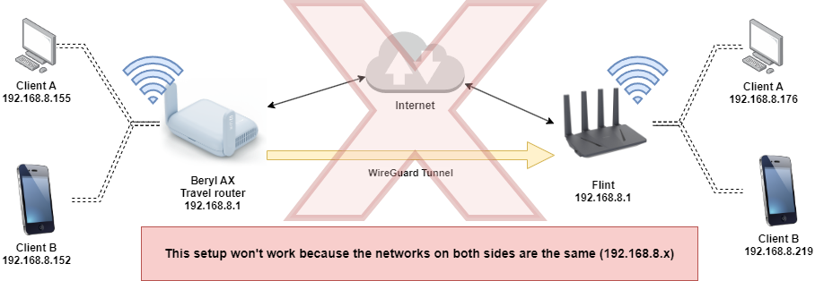
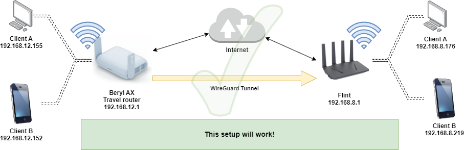
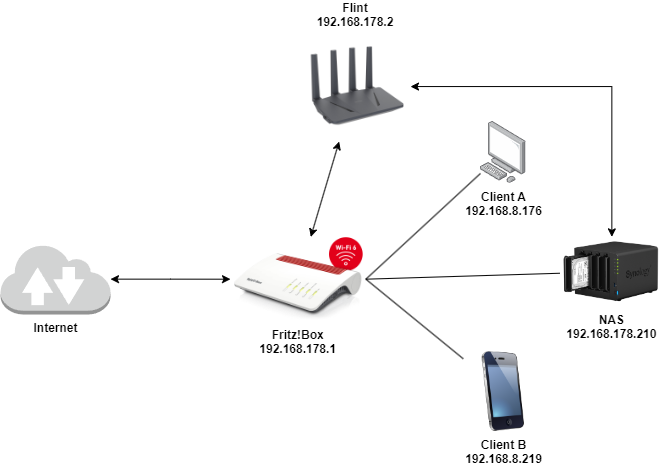

# WireGuard troubleshooting & general tips

## Inhaltsverzeichnis

- [WireGuard troubleshooting \& general tips](#wireguard-troubleshooting--general-tips)
  - [Inhaltsverzeichnis](#inhaltsverzeichnis)
  - [Wieso WireGuard?](#wieso-wireguard)
  - [Ich finde "VPN" nicht in der Web-Oberfläche](#ich-finde-vpn-nicht-in-der-web-oberfläche)
  - [Wie muss mein Netzwerk konfiguriert sein?](#wie-muss-mein-netzwerk-konfiguriert-sein)
    - [Das funktioniert nicht](#das-funktioniert-nicht)
    - [Das funktioniert](#das-funktioniert)
  - [Mobilfunk \& StarLink](#mobilfunk--starlink)
  - [Portweiterleitung](#portweiterleitung)
  - [Dynamische IP-Adressen](#dynamische-ip-adressen)
  - [Gesperrte Ports](#gesperrte-ports)
  - [WireGuard Konfiguration](#wireguard-konfiguration)
    - [Den gesamten Traffic über den Tunnel leiten](#den-gesamten-traffic-über-den-tunnel-leiten)
    - [DNS-Server anpassen](#dns-server-anpassen)
  - [Die Sache mit der MTU](#die-sache-mit-der-mtu)
  - [UDP und seine Tücken](#udp-und-seine-tücken)


## Wieso WireGuard?

WireGuard ist ein modernes VPN-Protokoll, welches auf dem neuesten Stand der Technik ist. Es ist einfach zu konfigurieren und bietet eine hohe Sicherheit. WireGuard ist in den Linux-Kernel integriert und wird von vielen Betriebssystemen unterstützt. Es ist schneller und sicherer als OpenVPN und IPsec.

Im Gegensatz zu OpenVPN bietet WireGuard bessere Multi-Thread-Unterstützung, was bedeutet, dass es besser für moderne Prozessoren geeignet ist. Auf den GL.iNet Routern läuft es daher mit höherer Geschwindigkeit.

## Ich finde "VPN" nicht in der Web-Oberfläche

Wenn Sie "VPN" nicht in der Web-Oberfläche finden, haben Sie wahrscheinlich eine Firmware-Version, die WireGuard nicht unterstützt. Dies ist der Fall wenn Sie ein Gerät für die alleinige Nutzung in China gekauft haben. Diese Geräte erkennen Sie nach dem Login an dem "CN" im Webinterface.

Es gibt keine offiziell unterstützte Möglichkeit, die Firmware so zu ändern, um WireGuard zu aktivieren. Die Nutzung von WireGuard in `luci` ist jedoch möglich.

## Wie muss mein Netzwerk konfiguriert sein?

Für WireGuard ist es notwendig, dass die IP-Adressen der Geräte im Netzwerk eindeutig sind. Das bedeutet, dass die IP-Adressen der Geräte im lokalen Netzwerk nicht mit den IP-Adressen des WireGuard-Netzwerks übereinstimmen dürfen. Sprich: Das Netzwerk (Standard bei GL.iNet Routern `192.168.8.x` sowie `192.168.9.x`) darf nicht auf beiden Seiten verwendet werden!

Sie sollten daher sicherstellen, dass nur auf einer Seite die Standardkonfiguration verwendet wird! Einer der beiden Router muss auf jeden Fall umkonfiguriert werden.

### Das funktioniert nicht



### Das funktioniert



## Mobilfunk & StarLink

Wenn Sie WireGuard über Mobilfunk oder StarLink nutzen, bedeutet dies, dass Sie [CGNAT](https://en.wikipedia.org/wiki/Carrier-grade_NAT) verwenden. Dies bedeutet, dass Sie keine öffentliche IP-Adresse haben und daher keine **eingehenden** Verbindungen empfangen können. Sie können nur ausgehende Verbindungen herstellen. Der Router hinter dem Mobilfunk- oder StarLink-Router kann somit **nicht** als Server verwendet werden - sehr wohl aber als Client.

Eine mögliche Alternative ist die Verwendung von [Tailscale](https://tailscale.com/) oder AstroRelay. Diese Dienste ermöglichen es, dass Geräte hinter CGNAT-Netzwerken miteinander kommunizieren können. Tailscale ist ein kostenloser Dienst, der auf WireGuard basiert und eine einfache Konfiguration bietet. Nicht jeder Router unterstützt Tailscale, aber die meisten GL.iNet Router können Tailscale verwenden.

Wenn Sie sich nicht sicher sind, ob Sie von CGNAT betroffen sind, können Sie [hier](https://ip.bieringer.net/cgn-test.html?redirect=1) einen Test durchführen.

## Portweiterleitung

Sofern Ihr GL.iNet Router nicht direkt am Internet angeschlossen ist, sondern hinter einem anderen Router betrieben wird, müssen Sie die Ports für WireGuard weiterleiten. Die Ports, die Sie weiterleiten müssen, sind in der WireGuard-Konfiguration angegeben. Standardmäßig sind dies die Ports `51820/udp`.

Solch ein Setup funktioniert ebenfalls, wenn die Portweiterleitung korrekt konfiguriert ist:



## Dynamische IP-Adressen

Die meisten Internetanschlüsse haben eine dynamische IP-Adresse. Das bedeutet, dass sich die IP Ihres Routers von Zeit zu Zeit ändert. Wenn Sie also einen Server betreiben, der über WireGuard erreichbar sein soll, müssen Sie eine dynamische DNS-Adresse verwenden. Diese Dienste ermöglichen es, dass Sie immer über denselben Namen auf Ihren Router zugreifen können, auch wenn sich die IP-Adresse ändert.

Standardmäßig unterstützen die GL.iNet Router den Dienst [GL.iNet DDNS](https://docs.gl-inet.com/router/en/4/interface_guide/ddns/#enable-ddns). Dieser Dienst ist kostenlos und einfach zu konfigurieren. Sie können auch andere DDNS-Dienste verwenden, wenn Sie dies bevorzugen. Denken Sie daran, dass Sie die DDNS-Adresse in der WireGuard-Konfiguration verwenden müssen, um auf Ihren Router zuzugreifen!

Die Nutzung eines DDNS-Dienstes macht Ihren Router nicht automatisch aus dem Internet erreichbar - und stellt somit keine Sicherheitslücke dar.

## Gesperrte Ports

Manche Internetanbieter (Hallo Spectrum 👋) sperren bestimmte Ports. Wenn Sie also Probleme mit der Verbindung haben, kann es sein, dass Ihr Internetanbieter den Port blockiert. In diesem Fall können Sie versuchen, den Port zu ändern. Empfehlenswert ist das Ausprobieren eines Ports wie 51825.

Denken Sie daran, dass Sie den Port sowohl in der WireGuard-Konfiguration als auch in der Portweiterleitung ändern müssen, falls genutzt.

## WireGuard Konfiguration

Die WireGuard-Konfiguration ist einfach und wird in der Hilfe von GL.iNet ausführlich beschrieben. Sie finden hier die entsprechende [Anleitung](https://docs.gl-inet.com/router/en/4/interface_guide/wireguard_server/).

Eine Beispielkonfiguration könnte wie folgt aussehen:

```ini
[Interface]
Address = 10.0.0.2/24
PrivateKey = OhE6JnWISeTq1upiASGxJcnNqWmcJcnNqWmc=
DNS = 64.6.64.6
MTU = 1420

[Peer]
AllowedIPs = 0.0.0.0/0,::/0
Endpoint = xxxxxx.glddns.com:51820
PersistentKeepalive = 25
PublicKey = 3J6JnWISeTq1upiASGxJcnNqWmcsajjkw1213ms=
```

| Bereich   | Schlüssel           | Beschreibung                                             |
| --------- | ------------------- | -------------------------------------------------------- |
| Interface | Address             | Die IP-Adresse des Routers im WireGuard-Netzwerk         |
| Interface | PrivateKey          | Der private Schlüssel des Routers                        |
| Interface | DNS                 | Der DNS-Server, der verwendet werden soll                |
| Interface | MTU                 | Die maximale Übertragungseinheit                         |
| Peer      | AllowedIPs          | Die IP-Adressen, die über den Tunnel erreichbar sind     |
| Peer      | Endpoint            | Die IP-Adresse und der Port des Servers                  |
| Peer      | PersistentKeepalive | Die Zeit in Sekunden, in der ein Keepalive gesendet wird |
| Peer      | PublicKey           | Der öffentliche Schlüssel des Servers                    |

### Den gesamten Traffic über den Tunnel leiten

Standardmäßig wird der gesamte Traffic über den Tunnel geleitet. Das bedeutet, dass alle Anfragen, die von Ihrem Router kommen, über den Tunnel an den Server gesendet werden. Der Server leitet die Anfragen dann ins Internet weiter. Dies hat zur Folge, dass Sie mit der IP-Adresse des Servers im Internet erscheinen - perfekt für die Umgehung von Geoblocking oder um eine andere IP-Adresse zu verwenden. Dies wird ermöglicht durch die Zeile `AllowedIPs = 0.0.0.0/0,::/0`

Sollten Sie z.B. nur auf Ihr Netzwerk zuhause zugreifen wollen, um z.B. auf Ihre NAS zuzugreifen, können Sie die Zeile `AllowedIPs =` auf Ihr lokales Netzwerk beschränken. In unserem grafischen Beispiel von oben wäre dies dann `AllowedIPs = 192.168.8.0/24`

### DNS-Server anpassen

In der Konfiguration können Sie auch den DNS-Server anpassen. Standardmäßig wird UltraDNS (64.6.64.6) verwendet, Sie können aber auch jeden anderen DNS-Server verwenden.

## Die Sache mit der MTU

Die MTU (Maximum Transmission Unit) ist die maximale Größe eines Datenpakets, das über das Netzwerk gesendet werden kann. Die MTU wird in der Regel automatisch ermittelt, aber manchmal kann es zu Problemen kommen, wenn die MTU zu groß ist. In diesem Fall können Sie die MTU in der WireGuard-Konfiguration anpassen. Standardmäßig ist die MTU auf 1420 gesetzt, was in den meisten Fällen funktioniert. Wenn Sie jedoch Probleme mit der Verbindung haben, können Sie die MTU auf einen niedrigeren Wert setzen, z.B. 1400.

Dies passen Sie in der Konfigurationsdatei unter `[Interface]` an.

## UDP und seine Tücken

WireGuard verwendet standardmäßig das UDP-Protokoll. Dieses Protokoll hat den Vorteil, dass es schneller ist als TCP, da es keine Bestätigungen benötigt. Es ist jedoch auch anfälliger für Paketverluste. Wenn Sie Probleme mit der Qualität der Verbindung haben und eine Anpassung des MTU-Werts nicht hilft, können Sie versuchen [OpenVPN im TCP-Modus](https://docs.gl-inet.com/router/en/4/interface_guide/openvpn_server/) zu verwenden.
