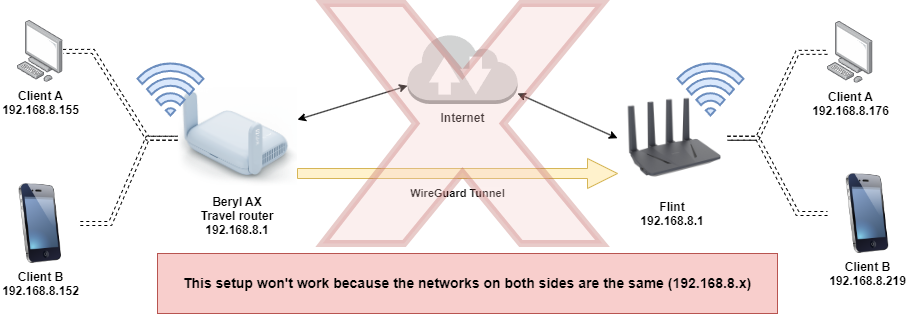
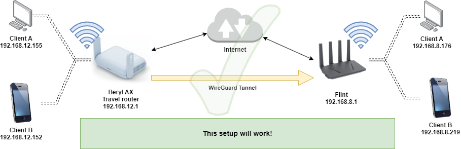
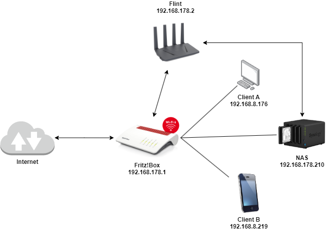

# Table of Contents
- [Table of Contents](#table-of-contents)
- [Why WireGuard?](#why-wireguard)
- [I can't find "VPN" in the web interface](#i-cant-find-vpn-in-the-web-interface)
- [How should my network be configured?](#how-should-my-network-be-configured)
  - [This doesn't work](#this-doesnt-work)
  - [This works](#this-works)
- [Mobile Networks \& StarLink](#mobile-networks--starlink)
- [Port Forwarding](#port-forwarding)
- [Dynamic IP Addresses](#dynamic-ip-addresses)
- [Blocked Ports](#blocked-ports)
- [WireGuard Configuration](#wireguard-configuration)
  - [Route all traffic through the tunnel](#route-all-traffic-through-the-tunnel)
  - [Adjust DNS server](#adjust-dns-server)
- [The MTU Issue](#the-mtu-issue)
- [UDP and its pitfalls](#udp-and-its-pitfalls)

# Why WireGuard?

WireGuard is a modern VPN protocol that is at the cutting edge of technology. It is easy to configure and offers high security. WireGuard is integrated into the Linux kernel and is supported by many operating systems. It is faster and more secure than OpenVPN and IPsec.

Unlike OpenVPN, WireGuard offers better multi-thread support, meaning it is better suited for modern processors. On GL.iNet routers, it runs at higher speeds.

# I can't find "VPN" in the web interface

If you can't find "VPN" in the web interface, you probably have a firmware version that does not support WireGuard. This is the case if you purchased a device for use exclusively in China. These devices can be recognized by the "CN" in the web interface after logging in.

There is no officially supported way to change the firmware to enable WireGuard. However, using WireGuard in `luci` is possible.

# How should my network be configured?

For WireGuard to function, the IP addresses of devices on the network must be unique. This means the IP addresses of devices on the local network must not conflict with the IP addresses of the WireGuard network. In other words, the network (default for GL.iNet routers is `192.168.8.x` and `192.168.9.x`) should not be used on both sides!

Therefore, you should ensure that only one side uses the default configuration! One of the routers must definitely be reconfigured.

## This doesn't work



## This works



# Mobile Networks & StarLink

If you use WireGuard over a mobile network or StarLink, you are using [CGNAT](https://en.wikipedia.org/wiki/Carrier-grade_NAT). This means you do not have a public IP address and therefore cannot receive **incoming** connections. You can only establish outgoing connections. The router behind the mobile network or StarLink router cannot be used as a server but can be used as a client.

An alternative is to use services like [Tailscale](https://tailscale.com/) or AstroRelay. These services allow devices behind CGNAT networks to communicate with each other. Tailscale is a free service based on WireGuard and offers simple configuration. Not every router supports Tailscale, but most GL.iNet routers can use Tailscale.

If you're unsure whether you're affected by CGNAT, you can test it [here](https://ip.bieringer.net/cgn-test.html?redirect=1).

# Port Forwarding

If your GL.iNet router is not directly connected to the internet but is operated behind another router, you need to forward the ports for WireGuard. The ports you need to forward are specified in the WireGuard configuration. By default, these are the ports `51820/udp`.

Such a setup also works if the port forwarding is correctly configured:



# Dynamic IP Addresses

Most internet connections have a dynamic IP address. This means the IP of your router changes from time to time. If you operate a server that should be accessible via WireGuard, you need to use a dynamic DNS address. These services allow you to access your router with the same name even if the IP address changes.

By default, GL.iNet routers support the service [GL.iNet DDNS](https://docs.gl-inet.com/router/en/4/interface_guide/ddns/#enable-ddns). This service is free and easy to configure. You can also use other DDNS services if you prefer. Remember to use the DDNS address in the WireGuard configuration to access your router!

Using a DDNS service does not automatically make your router accessible from the internet, so it does not pose a security risk.

# Blocked Ports

Some internet providers (hello Spectrum 👋) block certain ports. If you have connection problems, it might be because your internet provider is blocking the port. In this case, you can try changing the port. It is recommended to try a port like 51825.

Remember to change the port in both the WireGuard configuration and the port forwarding settings if used.

# WireGuard Configuration

The WireGuard configuration is simple and is thoroughly described in the GL.iNet help. You can find the relevant [guide](https://docs.gl-inet.com/router/en/4/interface_guide/wireguard_server/).

A sample configuration might look like this:

```ini
[Interface]
Address = 10.0.0.2/24
PrivateKey = OhE6JnWISeTq1upiASGxJcnNqWmcJcnNqWmc=
DNS = 64.6.64.6
MTU = 1420

[Peer]
AllowedIPs = 0.0.0.0/0,::/0
Endpoint = xxxxxx.glddns.com:51820
PersistentKeepalive = 25
PublicKey = 3J6JnWISeTq1upiASGxJcnNqWmcsajjkw1213ms=
```

| Section   | Key                | Description                                             |
| --------- | ------------------ | ------------------------------------------------------- |
| Interface | Address            | The IP address of the router in the WireGuard network   |
| Interface | PrivateKey         | The private key of the router                           |
| Interface | DNS                | The DNS server to be used                               |
| Interface | MTU                | The maximum transmission unit                           |
| Peer      | AllowedIPs         | The IP addresses accessible through the tunnel          |
| Peer      | Endpoint           | The IP address and port of the server                   |
| Peer      | PersistentKeepalive| The time in seconds for sending a keepalive             |
| Peer      | PublicKey          | The public key of the server                            |

## Route all traffic through the tunnel

By default, all traffic is routed through the tunnel. This means all requests from your router are sent through the tunnel to the server. The server then forwards the requests to the internet. As a result, you appear on the internet with the IP address of the server—perfect for bypassing geoblocking or using a different IP address. This is enabled by the line `AllowedIPs = 0.0.0.0/0,::/0`.

If you only want to access your home network, e.g., to access your NAS, you can restrict the `AllowedIPs` line to your local network. In our graphical example above, this would be `AllowedIPs = 192.168.8.0/24`.

## Adjust DNS server

In the configuration, you can also adjust the DNS server. By default, UltraDNS (64.6.64.6) is used, but you can use any other DNS server.

# The MTU Issue

The MTU (Maximum Transmission Unit) is the maximum size of a data packet that can be sent over the network. The MTU is usually determined automatically, but sometimes problems can arise if the MTU is too large. In this case, you can adjust the MTU in the WireGuard configuration. By default, the MTU is set to 1420, which works in most cases. However, if you have connection problems, you can set the MTU to a lower value, such as 1400.

You can adjust this in the configuration file under `[Interface]`.

# UDP and its pitfalls

WireGuard uses the UDP protocol by default. This protocol has the advantage of being faster than TCP since it doesn't require acknowledgments. However, it is also more prone to packet loss. If you have issues with connection quality and adjusting the MTU doesn't help, you can try [OpenVPN in TCP mode](https://docs.gl-inet.com/router/en/4/interface_guide/openvpn_server/).